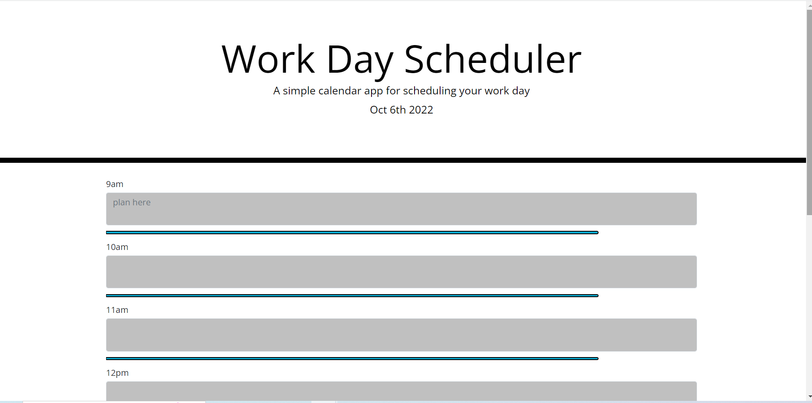

# Work Day Scheduler 

# Authors

Allen Klein

- [Link to Site]( https://allen-ek.github.io/day-planner/)
- [Link to Github Repository](https://github.com/allen-ek/day-planner)

## Why?
I wanted to create a work day planner with hourly timeblocks that allowed for writing of plans. That was able to be color coded by the current time. Such that any blocks before the time would be greyed out and present would be red and anything in the future would be green.
and display the day at the top of the page.
## What I learned
I lerned how to use api's in conjuction with javascript and html to display the recived information and to format it in order to display 
the web project in my styling.
## Technologies Used
Bootstrap
Jquery
Moment api
CSS

## Code Snippet
```html
$('textarea').each(function(){
    var currHour=d.getHours();
    var current=$(this).attr('id');
    if(current<currHour){
        $(this).css("background-color","silver");
    }
    else if(current>currHour){
        $(this).css("background-color","MediumSeaGreen");
    }
    else{
        $(this).css("background-color","Tomato");
    }    
});
```
The code snippet above was the code that allowed for the changing of timeblock color 
based off of the current time compared with the set time for the blocks.


